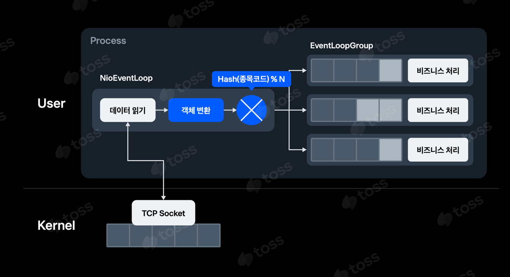

# Slashq 

- Message processing demo inspired by below conference
- Specific implementation can be different
- slash 23 (https://toss.im/slash-23/session-detail/B1-7)

## Feature

- Message Listening will be handled by netty io thread (default cpu *2) 
- Message processing will be handled by dedicated single thread 

## Not implemented

- Event loop queue (Change Schedulers.single to custom threadExecutor )
- Data Store with asyn 
